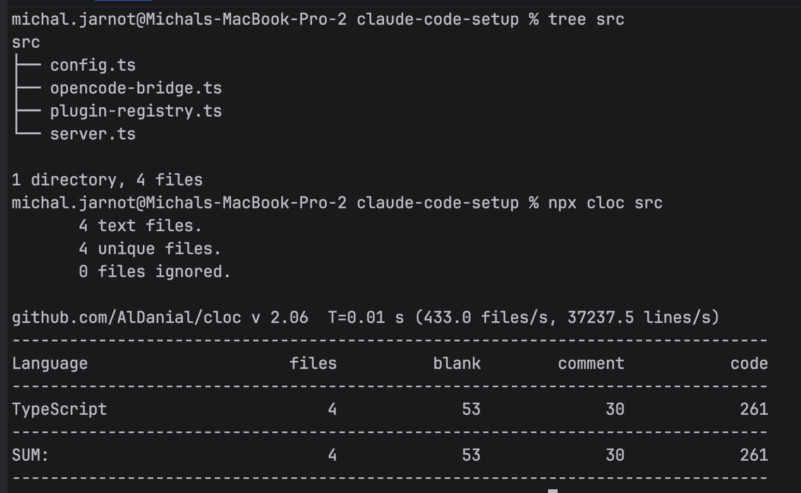

# Michal's OpenCode Cookbook

A shareable agentic setup for [OpenCode](https://opencode.ai) and Claude Code from a single codebase: plugins, skills, commands, and global agent instructions, written once and installed into both.

## Multi-provider orchestration

Being locked into one provider inside one harness is a real limitation: quotas and rate limits hit differently per provider, and a setup that only works in OpenCode is hard to hand to someone who prefers Claude Code. The `oc_*` tools expose the same local dispatch to both harnesses - either one can spawn a run against another provider's model using the `opencode` and `claude` CLIs already on the host, with no control plane, no containers, and no separate environment to manage.

`/pair-program` is the entry point. It opens a thinking-partner session against a chosen model (`openai/gpt-5.5` by default, any other GPT model, or a Claude model), hands back a session id, and every follow-up consultation for the rest of the task lands in that same thread - model switches included, even across providers: pass a different `model` on a later call with the same session id.


The Claude Code session on the left loads the `workflow-agentic` skill and dispatches a GPT-5.5 agent to analyze the project; it reports back the same structure the OpenCode session on the right produced natively. The next prompt in that same thread switches the conversation to a different model entirely, `glm-5.2`, using the session id GPT-5.5 just returned.

The bridge itself stays small. An early prototype came in at four TypeScript files, 261 lines total:



## How to run it

### 1. Install the CLIs

Both harnesses install via Homebrew:

```bash
brew install opencode
brew install --cask claude-code
```

### 2. Install dependencies and build

```bash
pnpm install
pnpm run build
```

Requires Node 24 (`mise.toml`; `mise install` gets it) and pnpm 11 (pinned via the `packageManager` field; `corepack enable` gets the right version).

### 3. Install into both harnesses

```bash
pnpm run symlink
```

This rebuilds `dist/`, copies the skills, commands, and global instructions into `~/.config/opencode/` and `~/.claude/`, and registers the MCP server with Claude Code. Rerun it whenever skills, commands, or plugin sources change - everything is installed as a real copy, not a symlink, so edits to the installed files are lost on the next rerun. Always edit the sources in this repo.

To install into just one harness: `pnpm run symlink:opencode` or `pnpm run symlink:claude-code`.

Claude Code asks for confirmation on every MCP tool call by default. To approve the whole server once, add to `~/.claude/settings.json`:

```json
{
  "permissions": {
    "allow": ["mcp__opencode"]
  }
}
```

Granular alternative: per-tool rules like `"mcp__opencode__codebase_find_definition"`.

## What it does

- Copies the skills and commands under `src/skills/` and `src/commands/` into both harnesses' global config directories, and copies `AGENTS.md` as the global instructions file each one reads on startup (`AGENTS.md` for OpenCode, `CLAUDE.md` for Claude Code). Installs are real copies, not symlinks, so a container bind-mounting `~/.config/opencode` still sees real files instead of dangling host paths.
- Defines a set of tools once, as OpenCode plugins, and exposes the same tools to both harnesses: OpenCode loads them natively through the plugin API, and Claude Code gets them through a bundled stdio MCP server that wraps the same plugin code.

## Plugins

| Module     | Tools | What it covers                                                                             |
| ---------- | ----- | -------------------------------------------------------------------------------------------- |
| `codebase` | 4     | TypeScript-aware code navigation: definitions, call tracing, unused symbols, project tree  |
| `opencode` | 5     | Local `opencode run` / `claude -p` dispatch and session store access                       |

**codebase** - `codebase_find_definition`, `codebase_trace_calls`, `codebase_find_unused_symbols` (TypeScript compiler API over the target project's own `tsconfig.json`), and `codebase_project_structure` (works on any directory).

**opencode** - `oc_run` (sync or async dispatch), `oc_get_run_status`, `oc_get_session`, `oc_list_sessions`, `oc_search_sessions`.

## OpenCode run dispatch

Model id routes the runner: provider-prefixed ids (`openai/gpt-5.5`, `openai/gpt-5.6-sol`) spawn `opencode run`; bare claude ids or aliases (`claude-fable-5`, `haiku`) spawn `claude -p`. Any other un-prefixed model id is rejected - nothing routes to a default runner silently. Dispatch modes (sync vs async), the full `oc_*` tool surface, model selection, and the consultation patterns are documented in the `workflow-agentic` skill; this section covers only the operator-facing configuration.

Sessions are runtime-bound. OpenCode sessions (`ses_*`) persist in OpenCode's local SQLite store (`~/.local/share/opencode/opencode.db`), the same place interactive sessions live, and are readable via `oc_get_session`, `oc_list_sessions`, and `oc_search_sessions`. Claude sessions (UUID ids) are JSONL transcripts under `~/.claude/projects/` - the session tools reject them with an explicit error, and continuing one requires `oc_run` with a claude model and the same `cwd` as the original run. Claude child processes inherit the user's global `~/.claude/settings.json` permissions.

### Configuration

The plugin resolves each path from an environment variable, falling back to the defaults below.

| Env var                      | Default                                      | Purpose                                                |
| ----------------------------- | --------------------------------------------- | -------------------------------------------------------- |
| `OPENCODE_BIN`               | `opencode` (resolved from PATH)              | Override path to the opencode binary                   |
| `CLAUDE_BIN`                 | `claude` (resolved from PATH)                | Override path to the claude binary (claude-model runs) |
| `OPENCODE_DB_PATH`           | `~/.local/share/opencode/opencode.db`        | Override SQLite database path                          |
| `OPENCODE_ASYNC_LOG_DIR`     | `~/.local/share/opencode/oc-async-runs`      | Where async run logs are written (both runners)         |
| `OPENCODE_RUN_REGISTRY_PATH` | `~/.local/share/opencode/oc-async-runs.json` | Where the async run registry lives (both runners)       |

## Commands and skills

One command ships with the setup:

- `/pair-program` - spawn a persistent thinking-partner session via a local opencode run and keep consulting it in the same thread

The skills:

- `workflow-agentic` - conventions for dispatching local opencode runs as agentic workers (sync vs async, model selection, session continuity, multi-model fanout)
- `language-typescript` - TypeScript conventions and architecture guidance
- `workflow-git-cli` - Git CLI workflow conventions (branching, staging, commits, PRs)
- `workflow-git-worktree` - git worktree conventions for parallel multi-agent work
- `write-skill` - conventions for authoring SKILL.md files
- `write-command` - conventions for authoring OpenCode command files
- `develop-opencode-plugins` - patterns for implementing or extending the plugins in this repo

## Authentication

The two plugins in this repo need no credentials. This section explains how auth works so you know where credentials live when you add plugins that talk to external services.

**Where OpenCode stores credentials.** OpenCode persists provider credentials in `~/.local/share/opencode/auth.json` (XDG data dir, file mode 0600), written by `opencode auth login` (CLI) or `/connect` (TUI). Providers that need refreshable OAuth state keep it in separate files under `~/.config/opencode/` (for example, an Atlassian plugin storing OAuth client credentials for token refresh).

**Custom plugins and `opencode auth login`.** The auth CLI only knows about providers that are registered with OpenCode. A custom plugin shows up there only if it implements an auth provider (the `auth` hook on the plugin, with its `methods` and optional `loader`). Without that hook, `opencode auth login` has nothing to store the credential against - the plugin must read its credentials from its own config file or environment variables instead.

**How the Claude Code MCP server authenticates.** It doesn't - the server has no auth logic of its own. The plugins read and refresh their credentials from the same files they use under OpenCode, entirely through the filesystem. Connect a provider once via OpenCode and it works in Claude Code automatically; the MCP server never needs to be configured separately. Project-scoped plugin config also keeps working: Claude Code starts the server in the active project directory, so files under a project's `.opencode/config/` resolve per project exactly as under OpenCode.

## How the MCP server works

`src/mcp/server.ts` starts a stdio MCP server. At startup it instantiates the plugin factories from this repo with a shim client (structured logs and toasts land on stderr), converts each tool's zod arg schema to JSON Schema, and registers every tool over MCP: zod-parsed arguments in, markdown text out, image attachments as MCP image content, abort signal wired through to the tool context.

The plugins' interactive permission prompts (`context.ask`) resolve unconditionally in this port - Claude Code's own permission layer (`mcp__opencode__*` rules) is the single gate in front of every tool.

The server spawns per-session over stdio (no persistent background process). Verify the installation with:

```bash
claude mcp get opencode   # Should show: Status ✔ Connected
ls ~/.claude/skills       # Should show skill directories
ls ~/.claude/commands     # Should show command .md files
```

## Development

The toolchain: TypeScript 7 for compilation and typechecking, oxlint with type-aware rules (via `oxlint-tsgolint`), and oxfmt for formatting. Dependencies are pinned to exact versions and managed with pnpm.

```bash
pnpm run build         # compile src/ to dist/
pnpm run typecheck     # type-check without emitting
pnpm run lint          # oxlint (.oxlintrc.json, type-aware)
pnpm run format        # oxfmt write mode (.oxfmtrc.json)
pnpm run format:check  # oxfmt check mode
```

`lint/naming.plugin.mjs` is a custom oxlint plugin enforcing `I`-prefixed interfaces, `T`-prefixed type parameters, camelCase private members, and intent-bearing boolean prefixes (`is`/`has`/`can`/...).

One note on the dual TypeScript dependency: TypeScript 7 (the native compiler) no longer ships the programmatic compiler API, so the codebase plugin's LSP service imports it from `typescript-api`, an alias for `typescript@5.9`. The `typescript` devDependency (7.x) provides `tsc` for building this repo; `typescript-api` is the runtime library the tools analyze other projects with.

## Troubleshooting

**Tools don't appear in Claude Code**

- Restart Claude Code entirely (don't just switch sessions). The MCP server is loaded at session start.
- Verify `claude mcp get opencode` shows status ✔ Connected.

**Skills/commands not updating after source change**

- Edits to the installed copies at `~/.claude/` or `~/.config/opencode/` are lost on the next symlink run.
- Edit the sources in `src/skills/` or `src/commands/`, then rerun `pnpm run symlink`.

**My `~/.claude/CLAUDE.md` was replaced**

- The Claude Code installer backs up a CLAUDE.md it does not manage to `~/.claude/CLAUDE.md.backup.<timestamp>` before installing its own. Merge anything you want to keep into this repo's `AGENTS.md` and rerun.
