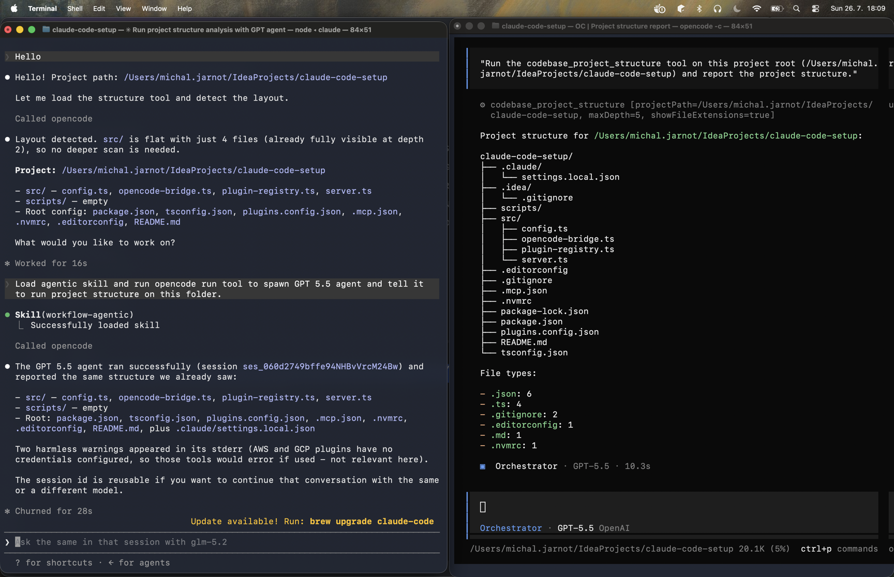

# Michal's OpenCode Cookbook

A shareable agentic setup for [OpenCode](https://opencode.ai) and Claude Code from a single codebase: plugins, skills, commands, and global agent instructions.

Written once and use everywhere.

## Multi-provider orchestration

`/pair-program` opens an adversarial thinking-partner session against any model (GPT, Claude, or another provider) from either harnes.


*Claude Code dispatches a GPT-5.5 agent to redo what OpenCode just did natively, then switches that same session to a different model.*

## How to run it

**1. Install the CLIs**

```bash
brew install opencode
brew install --cask claude-code
```

**2. Install dependencies and build**

```bash
pnpm install
pnpm run build
```

Requires Node 24 (`mise install`) and pnpm 11 (pinned via `packageManager`; `corepack enable` gets it).

**3. Install into both harnesses**

```bash
pnpm run symlink
```

Installs skills, commands, and instructions into both harnesses and registers the MCP server with Claude Code. Rerun after any source change - installs are copies, so edit the sources here, not the installed files. One harness only: `pnpm run symlink:opencode` or `pnpm run symlink:claude-code`.

Claude Code asks for confirmation on every MCP tool call by default. Approve the whole server once via `~/.claude/settings.json`:

```json
{
  "permissions": {
    "allow": ["mcp__opencode"]
  }
}
```

## What it does

- Copies the skills and commands under `src/skills/` and `src/commands/`, plus `AGENTS.md`, into both harnesses' global config folders (`AGENTS.md` for OpenCode, `CLAUDE.md` for Claude Code) as real copies, not symlinks.
- Defines tools once as OpenCode plugins. OpenCode loads them natively; Claude Code gets the same tools through a bundled MCP server.

## Plugins

| Module     | Tools | Covers                                                                | Tool names                                                                      |
| ---------- | ----- | ---------------------------------------------------------------------- | ---------------------------------------------------------------------------------- |
| `codebase` | 4     | TypeScript-aware code navigation                                     | `codebase_find_definition`, `codebase_trace_calls`, `codebase_find_unused_symbols`, `codebase_project_structure` |
| `opencode` | 5     | Local `opencode run` / `claude -p` dispatch and session store access | `oc_run`, `oc_get_run_status`, `oc_get_session`, `oc_list_sessions`, `oc_search_sessions`                        |

Model id on `oc_run` routes the runner: provider-prefixed ids (`openai/gpt-5.5`) spawn `opencode run`; bare claude ids/aliases (`claude-fable-5`, `haiku`) spawn `claude -p`. Anything else is rejected. Full dispatch, model selection, and consultation patterns live in the `workflow-agentic` skill.

<details>
<summary>Env var overrides for the opencode plugin</summary>

| Env var                      | Default                                      | Purpose                          |
| ----------------------------- | --------------------------------------------- | ----------------------------------- |
| `OPENCODE_BIN`               | `opencode` (resolved from PATH)              | Path to the opencode binary      |
| `CLAUDE_BIN`                 | `claude` (resolved from PATH)                | Path to the claude binary        |
| `OPENCODE_DB_PATH`           | `~/.local/share/opencode/opencode.db`        | SQLite database path             |
| `OPENCODE_ASYNC_LOG_DIR`     | `~/.local/share/opencode/oc-async-runs`      | Async run logs                   |
| `OPENCODE_RUN_REGISTRY_PATH` | `~/.local/share/opencode/oc-async-runs.json` | Async run registry               |

</details>

## Commands and skills

- `/pair-program` - spawn a persistent thinking-partner session via a local opencode run and keep consulting it in the same thread

Skills: `workflow-agentic` (dispatching local opencode runs), `language-typescript`, `workflow-git-cli`, `workflow-git-worktree`, `write-skill`, `write-command`, `develop-opencode-plugins` (extending the plugins in this repo).

## Authentication

The two plugins here need no credentials. OpenCode stores provider credentials in `~/.local/share/opencode/auth.json` (`opencode auth login` or `/connect`). The Claude Code MCP server has no auth of its own - it reads the same files, so connecting a provider once via OpenCode works in Claude Code automatically.

## Development

TypeScript 7, oxlint (type-aware, via `oxlint-tsgolint`), oxfmt. Dependencies pinned exact, managed with pnpm.

```bash
pnpm run build         # compile src/ to dist/
pnpm run typecheck     # type-check without emitting
pnpm run lint          # oxlint
pnpm run format        # oxfmt write mode
```

`lint/naming.plugin.mjs` enforces `I`-prefixed interfaces, `T`-prefixed type parameters, camelCase private members, and intent-bearing boolean prefixes.

## Troubleshooting

**Tools don't appear in Claude Code** - restart it entirely (session start loads the MCP server); verify with `claude mcp get opencode`.

**Skills/commands not updating** - you edited the installed copy. Edit `src/skills/` or `src/commands/` instead, then rerun `pnpm run symlink`.

**My `~/.claude/CLAUDE.md` was replaced** - an unmanaged one gets backed up to `CLAUDE.md.backup.<timestamp>` first. Merge what you want into `AGENTS.md` and rerun.
